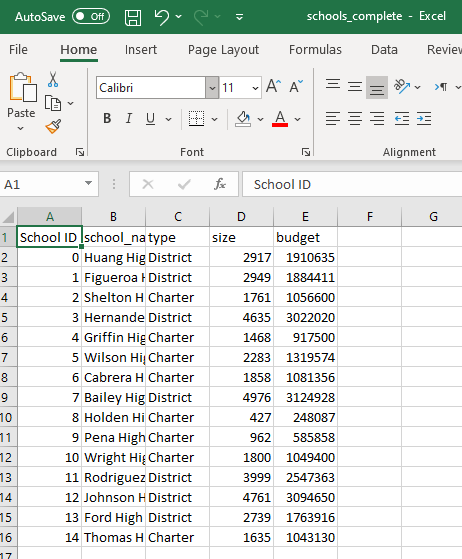
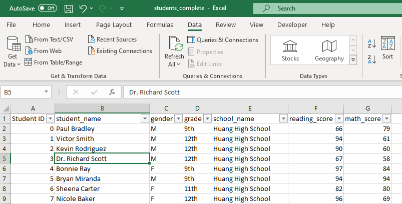

# School District Analysis

## Project Overview
The School board has received the analyiss of all schoool in the district and their student's performance in a recent academinc evaluation.

Later the school board has found out that the students_complete.csv file shows evidence of academic dishonesty; specifically, reading and math grades for Thomas High School ninth graders appear to have been altered. Although the school board does not know the full extent of the academic dishonesty, it was deemed necessary to repeat the school district analysis by replacing all grade 9 scores at Thomas High School with null values and evaluate the impact.
The analysis requested are:
-The district summary
-The school summary
-The top 5 and bottom 5 performing schools, based on the overall passing rate
-The average math score for each grade level from each school
-The average reading score for each grade level from each school
-The scores by school spending per student, by school size, and by school type

## Resources
- Data source: 
    - School Data "schools_complete.csv" [Link to schools raw data](Resources/schools_complete.csv)
    - Students Data "students_complete.csv" [Link to students raw data](Resources/students_complete.csv)
    
- Software: Anaconda Jupyter notebook Python 3.7 and panda
- Link to the Jupyter notebook which performs analysis for challenge is : [PyCitySchools_Challenge.ipynb](PyCitySchools_Challenge.ipynb)
- Data sources format : see the below screenshot to see the expected file format for data source.

  
  
  

## Analysis Results

## Summary
 
